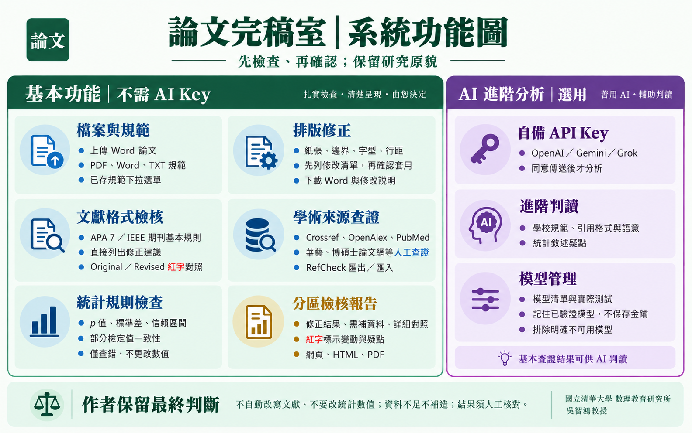
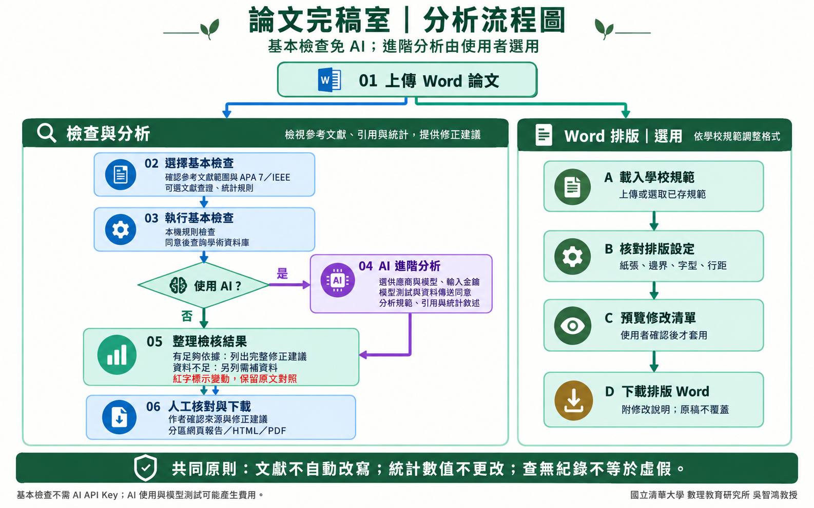

# 論文完稿室｜系統圖解

## 系統功能圖

基本功能不需要 AI API Key。學術來源中，Crossref、OpenAlex、PubMed 可自動查詢；華藝、博碩士論文網等需人工查證，RefCheck 採匯出／匯入。AI 為選用功能，支援 OpenAI、Gemini 與 Grok。

## 分析流程圖

1. 上傳 Word 論文。
2. 檢查路徑：選擇文獻格式／查證與統計規則，確認資料庫傳送同意後執行。可不使用 AI，直接整理檢查結果；若選用 AI，另填金鑰、選模型並確認資料傳送。
3. 有足夠來源資料時列出完整修正建議；資料不足時另列需補資料，不補造文獻。由作者核對後下載網頁、HTML 或 PDF 報告。
4. 排版路徑另行載入學校規範，核對設定並預覽修改清單，確認後才產生排版 Word 與修改說明。

文獻修訂建議不自動寫回 Word，統計數值不更改；查無紀錄不等於虛假。AI 使用及模型測試可能產生 API 費用。

作者：國立清華大學 數理教育研究所 吳智鴻教授。

圖像以內建圖像生成工具製作，已核對主要文字與流程方向。[完整繪圖 Prompt 與生成方式](diagram-prompts.md)。
